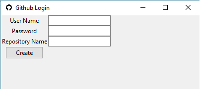
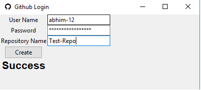

# Automating Github Repository Creation  
	Automaing Gihub Login and Repository creation.
	Tkinter is used to provide a GUI with the following fields :  
		User Name
		Password
		Repository Name
	Selenium webdriver is used to run the automation in headless mode.
	Once the repo is created, a message is displayed in the tkinter window.

## Note:  
	Git needs to be installed locally on the system.

## Screenshots :  
 

 
